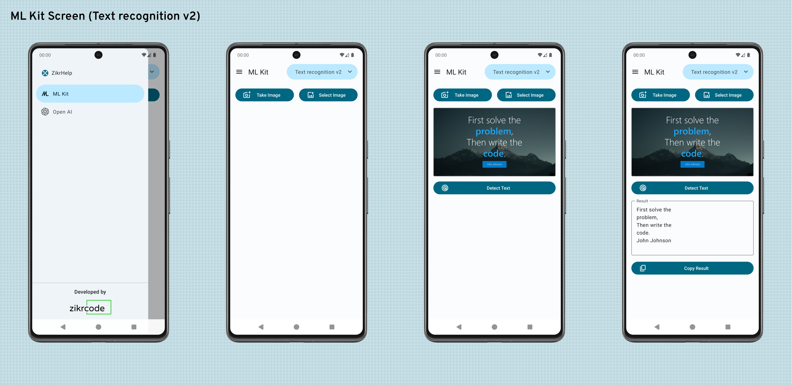
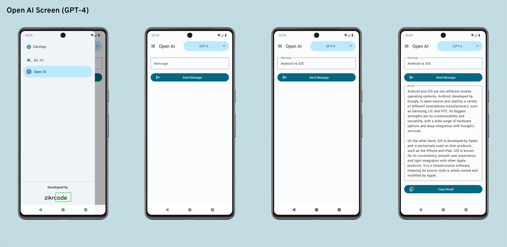
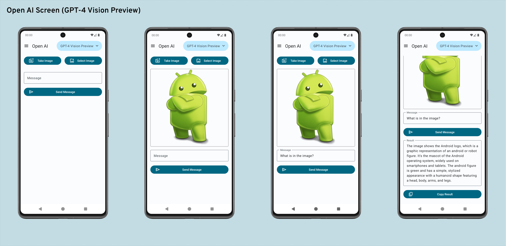

# ZikrHelp

App Empowering Users with ML Kit and OpenAI Integration! ZikrHelp is a mobile application designed to provide assistance in various tasks utilizing Machine Learning and OpenAI technologies. The app consists of two main screens: the ML Kit Screen and the OpenAI Screen, each implementing different models to serve specific purposes.

## All Screens

**ML Kit Screen**


**Open AI Screen**



## Technologies Used

- **Jetpack Compose**: This modern UI toolkit is the cornerstone for constructing the native Android user interface, ensuring a contemporary and user-friendly design.

- **Navigation Component**: Navigation Component is a Jetpack library that simplifies the implementation of navigation in Android apps. It provides a consistent and robust way to navigate between different screens and manage the navigation flow.

- **Hilt**: Hilt is a dependency injection library for Android that is built on top of Dagger. It simplifies the process of dependency injection, making it easier to manage and organize dependencies in your Android app.

- **Coil**: Coil is an image loading library for Android. It simplifies the process of loading images from various sources such as network, disk, or local resources.

- **ML Kit Text Recognition**: ML Kit Text Recognition is a feature provided by Google's ML Kit, which allows the app to detect and extract text from images. It utilizes machine learning models to recognize text in various languages and formats.

- **Kotlin Serialization**: Kotlin library that provides support for serializing and deserializing data to and from JSON format. It offers a convenient and concise way to convert Kotlin objects into JSON strings and vice versa, making it easy to work with JSON data in Kotlin-based projects.

- **OkHttp**: OkHttp is a popular HTTP client for Android and Java applications. It simplifies network operations by providing a clean and concise API for sending HTTP requests and receiving responses.

## Installation

To run the ZikrHelp app, you need a valid Open AI API Key and Signing Configuration details.

1. **Open AI API Key:** Create a `secret.properties` file in the root directory of the project if it doesn't exist. Inside `secret.properties`, include the following line:
      ```
      OPEN_AI_API_KEY=<key>
      ```
      Replace `<key>` with your valid Open AI API Key. Without a valid API Key, the app will not function properly.

2. **Signing Configuration:** You have two options:
    - Provide the signing configuration details in `secret.properties` as follows:
      ```
        storeFile=<storeFilePath>
        storePassword=<storePassword>
        keyPassword=<keyPassword>
        keyAlias=<keyAlias>
      ```
      Ensure that the storeFile path is correctly specified and the necessary passwords and aliases are provided for signing the app.

    - Alternatively, delete the following lines from `build.gradle(Module:app)` file:
      ```Kotlin
        signingConfigs {
          create("release") {
            storeFile = file(secretProperties["storeFile"] as String)
            storePassword = secretProperties["storePassword"] as String
            keyPassword = secretProperties["keyPassword"] as String
            keyAlias = secretProperties["keyAlias"] as String
          }
        }
       ```

## Usage

Once you have set up your Open AI API Key and Signing Configuration, follow these steps to use the ZikrHelp app:

1. Launch the app on your Android device or emulator.

2. Navigate through the ML Kit Screen and the OpenAI Screen using the navigation drawer.

3. Follow the on-screen instructions to utilize the features of each screen.

## License

This project is licensed under the [Apache License 2.0](./LICENSE).